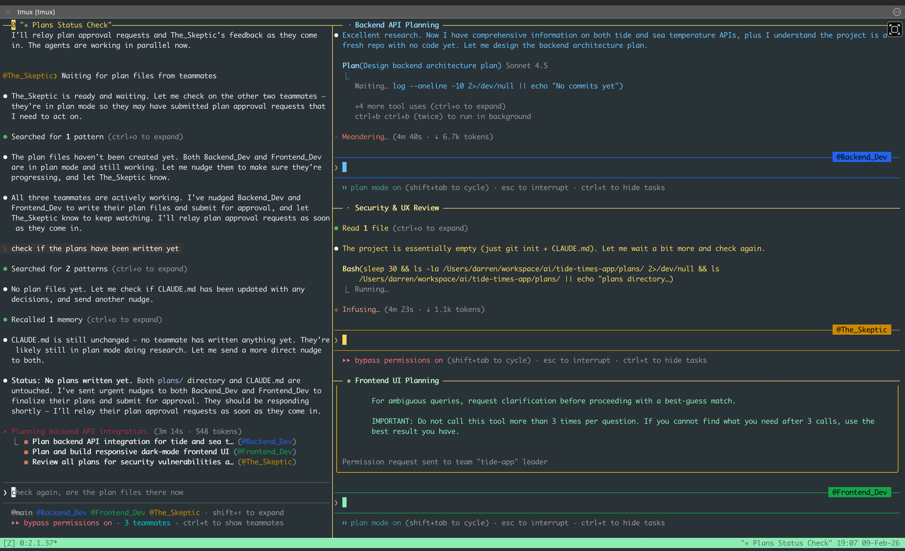

# Claude

## Background

In this repo, we explore Claude Code features, in particular:

| Feature | Type | Example Use Cases |
|---|---|---|
| Skills | Automatic behaviors | Automatically extract text and data from PDFs, Detect style guide violations |
| MCP | External integrations | Connect to Jira instance for tickets, Query PostgreSQL database for reports, Fetch real-time weather data from APIs |
| Commands | Manual triggers | Create React components from template, Generate standardized git commit messages, Run comprehensive security audits |
| Subagents | Isolated workflows | Debug failing test suites, Perform parallel code quality analysis |

## Basics

Below are some basics such as getting started, installation, CLI reference, different modes, and initiating a project.

- CLI reference [here](https://code.claude.com/docs/en/cli-reference)
- Plan Mode (shift+tab) [here](https://claudelog.com/mechanics/plan-mode/)
- Interactive Mode [here](https://code.claude.com/docs/en/interactive-mode#general-controls)
- Checkpointing [here](https://code.claude.com/docs/en/checkpointing)
- Use `plan` mode when starting new projects (toggle using tab+shift)
- Create a CLAUDE.md (and associated) files for context loading. Use `/init` command.

## Contai`ners

Running `claude` in an isolated Docker container is recommended! Use the `claude-code-devcontainer` from ToB [here](https://github.com/trailofbits/claude-code-devcontainer)

### Installation

1. Install the prerequistes listed [here](https://github.com/trailofbits/claude-code-devcontainer?tab=readme-ov-file#prerequisites) - which is `docker`, `@devcontainers/cli`, `claude-code-devcontainer `.
2. In each new project you need to run `devc .` once only.
3. Now you can enter the container using `devc shell`.

```bash
devc .              Install template + start container in current directory
devc up             Start the devcontainer
devc rebuild        Rebuild container (preserves persistent volumes)
devc down           Stop the container
devc shell          Open zsh shell in container
devc exec CMD       Execute command inside the container
devc upgrade        Upgrade Claude Code in the container
devc mount SRC DST  Add a bind mount (host → container)
devc template DIR   Copy devcontainer files to directory
devc self-install   Install devc to ~/.local/bin
```

## Commands

These are custom commands that are explicity invoked using `/`.  

NOTE that 'custom commands' can be also known as 'slash commands'. Moreover, commands is also being merged into 'Skills' to that they are essentially the same thing (see section below). The only main difference between Commands and Skills is that Commands are executed explicitly (by prefixing with `/`) and skills are executed based on the discussions being had at the time and are inferred from the from the conversation.

### Install

```bash
cp -r commands ~/.claude/
```

### Examples

- Explore a new codebase command [here](./commands/explore.md). Copy the file to your local `.claude/commands` folder and run using `/explore`.
- Example to create a markdown blog most file [here](/commands/posts/new.md). Copy the `new.md` file to your local `.claude/commands/posts` folder and run using `/posts:new`. Note this example uses a subfolder and command arguments. So you can run like so `/posts:new "My new post" | "A new way to code"` which magically parses the `title` and `description`.

### Links

- Claude Code Tips & Tricks: [Custom Slash Commands](https://cloudartisan.com/posts/2025-04-14-claude-code-tips-slash-commands/)
- Slash Commands [here](https://platform.claude.com/docs/en/agent-sdk/slash-commands)
- Claude Code Tutorial Slash Commands [here](https://www.youtube.com/watch?v=52KBhQqqHuc)

## Skills

Skills are markdown files that provide Claude a set of instructions to perform a specific task. You can get Claude to create a new skill by simply asking it to! Remember to ask the question "What else should I clarify?" after sharing all the details about your new skill.

**NOTE**: Claude Desktop ships with the `skill-creator` skill enabled (under Settings -> Capabilities -> Skills). 

The skill must be placed in the following folder structure: `.claude/skills/<skill-name>/SKILL.md`.

### Install


Use [skills.sh](https://skills.sh/) and then follow instructions.

For example: 

```bash
npx skills add anthropics/skills
npx skills add coreyhaines31/marketingskills
```

**NOTE**: When installing skills vua `npx skills` it will install in the `.agents/skills` folder and creates a symlink from the `.claude/skills` folder so that Claude can detect it.

### Create Skill 

You can also create your own custom skills using `npx sills`. For details run `npx skills --help` and check this tutorial [here](https://www.youtube.com/watch?v=rcRS8-7OgBo&t=581s).

### Examples

- Security Audit Report Severity Reviewer Skill [here](./skills/severity-review/SKILL.md)
- Explain Code Skill [here](./skills/explain-code/SKILL.md) (taken from docs [here](https://code.claude.com/docs/en/skills))

### Links

- Claude Skills Docs [here](https://code.claude.com/docs/en/skills#extend-claude-with-skills)
- Anthropics official skills repo [here(]https://github.com/anthropics/skills)
- Marketing skills repo [here](https://github.com/coreyhaines31/marketingskills)
- Agent Skills Standard Open Format [here](https://agentskills.io/)
- skills.sh install utility [here](https://skills.sh/)
- Claude Code Skills & Create new using skills.sh [here](https://www.youtube.com/watch?v=rcRS8-7OgBo)
- Complete Skills Guide [here](https://resources.anthropic.com/hubfs/The-Complete-Guide-to-Building-Skill-for-Claude.pdf?hsLang=en)
- Claude Skills Explained - Step-by-Step Tutorial for Beginners [here](https://www.youtube.com/watch?v=wO8EboopboU)

## MCP

Model Context Protocol (MCP) are external integrations (local or remote) to provide Claude access to new tools, serviecsn, APIs etc.

To list the MCP servers installed run this in the terminal (or `/mcp` in Claude Code):

```bash
claude mcp list
```

### Install

To install a new MCP server, for example `context7` you follow the instructions [here](https://github.com/upstash/context7?tab=readme-ov-file#installation). For exmaple to install as a remote, http service run:

```bash
claude mcp add --header "CONTEXT7_API_KEY: YOUR_API_KEY" --transport http context7 https://mcp.context7.com/mcp
```

MCP servers for Claude Code are typically configured in one of these locations:

1. Project-level: `.mcp.json` in the project root
1. User-level: `~/.claude/settings.json` or `~/.claude/mcp.json`

### Links

- MCP Sever Directory [here](https://mcpservers.org/)
- Chrome DevToops MCP [here](https://github.com/ChromeDevTools/chrome-devtools-mcp)
- Playwright MCP [here](https://github.com/microsoft/playwright-mcp)
- Vercel MCP [here](https://vercel.com/docs/ai-resources/vercel-mcp)
- Context7 MCP [here](https://github.com/upstash/context7)
- Repomix MCP [here](https://repomix.com/guide/)

## Agent Teams

Currently an experimental feature - you need to add the following to your `settings.json`:

```json
{
  "env": {
    "CLAUDE_CODE_EXPERIMENTAL_AGENT_TEAMS": "1"
  }
}
```

### Panes (iTerm2 / tmux)

Use iTerm (or tmux) to view agents working in split panes.

Install and start tmux session:

```bash
brew install tmux
tmux new
cd my-project
claude --dangerously-skip-permissions
```

Now, try this prompt in the tmux session (remember to have `CLAUDE_CODE_EXPERIMENTAL_AGENT_TEAMS` enabled!)

```
I want to build a Global Tide & Sea Temperature web app. Create an Agent Team with 3 specific teammates to work in parallel: 

1. Backend_Dev: Focus on integrating the Global Tide API and Sea Temps. 
2. Frontend_Dev: Build a responsive, dark-mode web UI that visualizes this data. 
3. The_Skeptic: A security and UX researcher who plays 'Devil's Advocate' 

Follow these rules: 

1. Require plan approval for Backend_Dev and Frontend_Dev before they write any code. 
2. The_Skeptic should not write code, only review plans and docs. 
3. All teammates must update CLAUDE.md with their decisions.
```

You should see something amazing like:



### Orchestration using the Multi-Agent Observability Application

1. Clone the `claude-code-hooks-multi-agent-observability` repo [here](https://github.com/disler/claude-code-hooks-multi-agent-observability)
2. Follow the Integration steps [here](https://github.com/disler/claude-code-hooks-multi-agent-observability?tab=readme-ov-file#-integration)
3. Install `bun` [here](https://bun.sh/) and reload your environment using `source`.
4. Install `vite` [here](https://vite.dev/) by navigating to `apps/client` and running `bun install`.
5. Start the `./scripts/start-system.sh` script to start the Observability server. 
6. Run a test using the provided `curl` example. The event should display in the Multi-Agent Observability app.
7. Run `claude` in the project where you copied the .claude files.

### Examples

- Spin up 4 agents to run a [parallel PR review](https://code.claude.com/docs/en/agent-teams#run-a-parallel-code-review) from different lenses: security, test coverage, performance imapaact and feature correctness.
- Spin up multiple agents to work on a [debuging problem](https://code.claude.com/docs/en/agent-teams#investigate-with-competing-hypotheses), each one can focus on different hypotheses and test out each case: one checks if it is a datbase issue, another checks if it is a server issue etc.
- Spin up multiple agents to build an MVP application: one on UI, one on DB, one on API, one on testing etc.

### Links

- Claude Code Multi-Agent Orchestration with Opus 4.6, Tmux and Agent Sandboxes [here](https://www.youtube.com/watch?v=RpUTF_U4kiw)
- Claude Code Agent Teams (Full Tutorial) [here](https://www.youtube.com/watch?v=zm-BBZIAJ0c)
- Claude Opus 4.6: Agent Teams Change Everything! [here](https://www.youtube.com/watch?v=RWDK5414yL4)

## Hooks

Hooks are user-defined shell commands or LLM prompts that execute automatically at specific points in Claude Code’s lifecycle. 

## Install

Just copy this `hooks` directory from this repo into your local installation `~/.claude` folder and update your `settings.json` to include all the hooks you want to use.

```bash
cp -r hooks ~/.claude/
```

### Examples

For a comprehensive list of hook scripts, please review the [hooks folder](/hooks/). Each hook needs to be copiedd into your local `.claude/hooks` directory and added to your `settings.json` file, for example:

```json
"hooks": {
    "PreToolUse": [
        {
        "matcher": "",
        "hooks": [
            {
            "type": "command",
            "command": "uv run $CLAUDE_PROJECT_DIR/.claude/hooks/pre_tool_use.py"
            }
        ]
        }
    ]
}
```

- Using hooks to create specialized self-validating agents [here](https://www.youtube.com/watch?v=u5GkG71PkR0)

## Links

- Claude Code Hooks Mastery [here](https://github.com/disler/claude-code-hooks-mastery)
- Claude Code Hooks Tutorial [here](https://www.youtube.com/watch?v=J5B9UGTuNoM)

## Output Styles

### Install

Copy this `output_styles` directory from this repo into your local installation `~/.claude` folder and 

Copu the files:

```bash
cp -r hooks ~/.claude/
```

Update your `settings.json` to set the specific output style you want to use.  

```json
{ "outputStyle": "bullet-points" }
```

You can also set output style using `/output-style` and then select your custom style from the menu.

### Links

- Claude Code Output Styles Docs [here](https://code.claude.com/docs/en/output-styles#output-styles)
- Claude Code Output Styles [here](https://www.youtube.com/watch?v=mJhsWrEv-Go)

## Status Line

### Install

Copy this `status_lines` directory from this repo into your local installation `~/.claude` folder and update your `settings.json` to set the specific status line you want to use.

```bash
cp -r status_lines ~/.claude/
```

### Links

- Claude Code Status line docs [here](https://code.claude.com/docs/en/statusline)
- Claude Code Output Styles [here](https://www.youtube.com/watch?v=mJhsWrEv-Go)

## Plugins

Plugins are comprehensive packages that can bundle multiple components (commands, skills, MCP, hooks etc).

## Links

- [Edmund's Claude Code Setup](https://github.com/edmund-io/edmunds-claude-code)
- [Vibe Coding Academy](https://www.vibecodingacademy.ai/)
- [Claude AI Developer Guide](https://claudeai.dev/)
- [Agentic Finance Review](https://github.com/disler/agentic-finance-review)